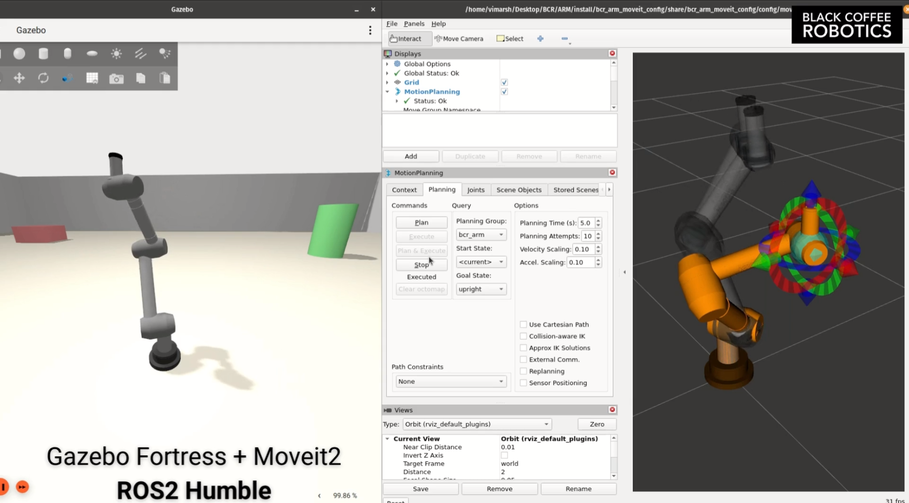
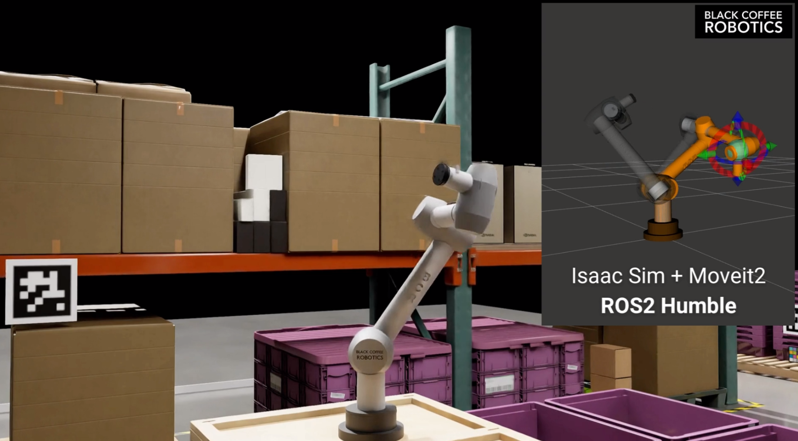
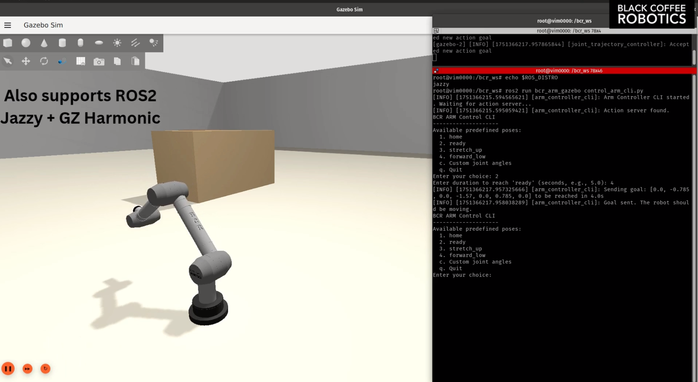

# BCR Arm

https://github.com/user-attachments/assets/3a08bc22-2d3c-4b57-9e81-967f29c440c9

## About

This repository contains a Gazebo Fortress simulation for a 7-DOF robotic arm. It includes ROS2 Control integration and MoveIt for motion planning. Currently, the project supports:

1. [ROS2 Humble + Gazebo Fortress (Ubuntu 22.04)](#humble--fortress-ubuntu-2204)
2. [ROS2 Jazzy + Gazebo Harmonic (Ubuntu 24.04)](#jazzy--harmonic-ubuntu-2404)
3. [Nvidia Isaac Sim](#nvidia-isaac-sim)


## Humble + Fortress (Ubuntu 22.04)

### Dependencies

Ensure you have ROS2 Humble and Gazebo Fortress installed.

```bash
# Install ROS2 Humble (if not already installed)
sudo apt update
sudo apt install -y ros-humble-desktop
# Install Gazebo Fortress
sudo apt install -y gz-fortress
```

Other dependencies can be installed using `rosdep` (from the root directory of your workspace):
```bash
# From the root directory of your workspace (e.g., ~/bcr_ws)
rosdep install --from-paths src --ignore-src -r -y
```

Build the project:

```bash
# From the root of your workspace
colcon build --symlink-install

# Source the workspace
source install/setup.bash
```

### Launch Files

#### 1. Gazebo Simulation with ROS2 Control and MoveIt2 Motion Planning
To launch the Gazebo simulation with ROS2 Control and MoveIt2 for motion planning, use the following command:
```bash
ros2 launch bcr_arm_moveit_config bcr_arm_moveit_gazebo.launch.py 
```

#### 2. Gazebo Simulation with ROS2 Control

This is the primary launch file to bring up the full simulation environment.
```bash
ros2 launch bcr_arm_gazebo bcr_arm.gazebo.launch.py
```
-  This uses ROS2 *mock controllers* for the arm. Use scripts from `bcr_arm_gazebo` to send commands to the arm. 
-  Supports launch argument: `world_path:=<path_to_world>`


## Jazzy + Harmonic (Ubuntu 24.04)

### Dependencies

Ensure you have ROS2 Jazzy and Gazebo Harmonic installed.

```bash
# Install ROS2 jazzy (if not already installed)
sudo apt update
sudo apt install -y ros-jazzy-desktop
# Install Gazebo Harmonic
sudo apt install -y gz-harmonic
```

Build topic_based_ros2_control from source (need to build from source for jazzy, to use Moveit with Isaac Sim):

```bash
git clone https://github.com/PickNikRobotics/topic_based_ros2_control.git
cd topic_based_ros2_control
rosdep install --from-paths src --ignore-src -r -y
colcon build --symlink-install --event-handlers log-
source install/setup.bash
```

Other dependencies can be installed using `rosdep` (from the root directory of your workspace):
```bash
# From the root directory of your workspace (e.g., ~/bcr_ws)
rosdep install --from-paths src --ignore-src -r -y
```

Build the project:

```bash
# From the root of your workspace
colcon build --symlink-install

# Source the workspace
source install/setup.bash
```


### Launch Files

#### 1. Gazebo Simulation with ROS2 Control and MoveIt2 Motion Planning
To launch the Gazebo simulation with ROS2 Control and MoveIt2 for motion planning, use the following command:
```bash
ros2 launch bcr_arm_moveit_config bcr_arm_moveit_gazebo.launch.py 
```

#### 2. Gazebo Simulation with ROS2 Control

This is the primary launch file to bring up the full simulation environment.
```bash
ros2 launch bcr_arm_gazebo bcr_arm.gazebo.launch.py
```
-  This uses ROS2 *mock controllers* for the arm. Use scripts from `bcr_arm_gazebo` to send commands to the arm.
-  Supports launch argument: `world_path:=<path_to_world>`


## Nvidia Isaac Sim

### Dependencies

Ensure you have Nvidia Isaac Sim installed.

- Download the Isaac Sim SDK from [here](https://developer.nvidia.com/isaac-sim)
- Install the SDK
- Launch Isaac Sim (.~/isaacsim/isaac-sim.sh) and load the [bcr_arm usd](isaacsim/bcr_arm_scene.usd)

### Launch 

To launch Isaac Sim and use Moveit for motion planning and control.

To launch the robot in Isaac Sim:

- Add in extra viewports for different camera views.
- Start the Simulation: Run the simulation directly within Isaac Sim.

To view and launch moveit:

```bash
ros2 launch bcr_arm_moveit_config isaac_demo.launch.py
```


## Controlling the Arm

Once the simulation with controllers is running (e.g., via `bcr_arm.gazebo.launch.py`), you can send commands.

**Using the CLI Script:**

A Python script is provided to send predefined or custom joint goals.
```bash
# Ensure your workspace is sourced
# ros2 run bcr_arm_gazebo test_arm_movement.py
ros2 run bcr_arm_gazebo control_arm_cli.py
```
Follow the on-screen prompts to select poses or enter custom joint angles.


## Images






